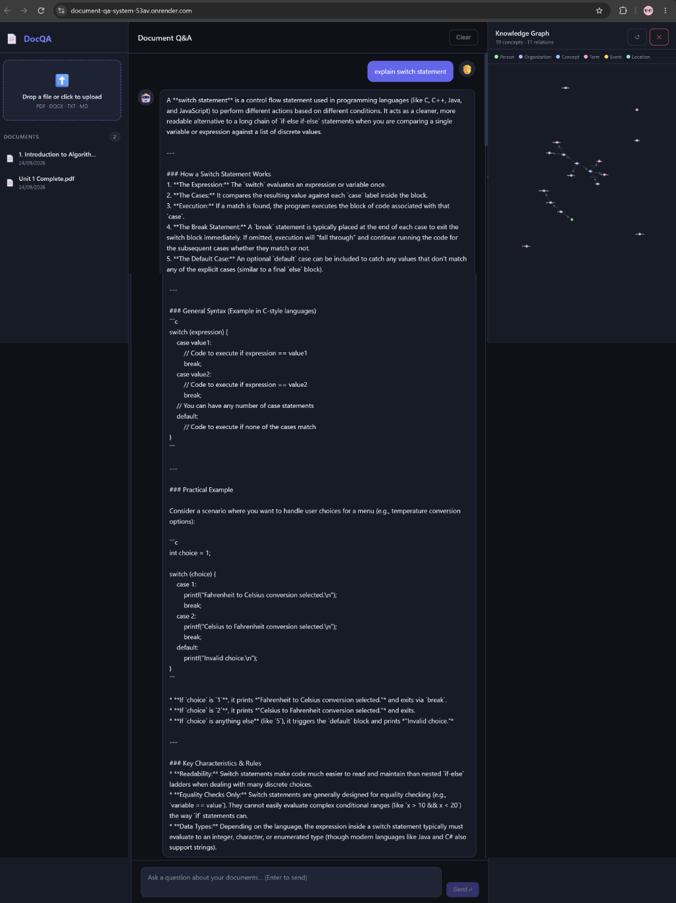
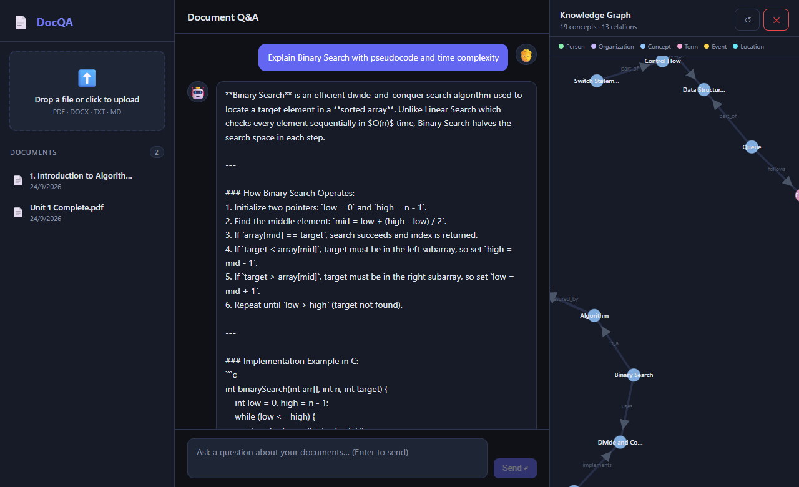
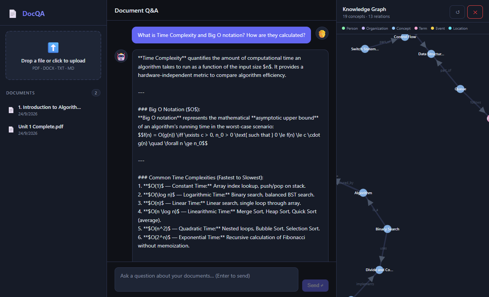
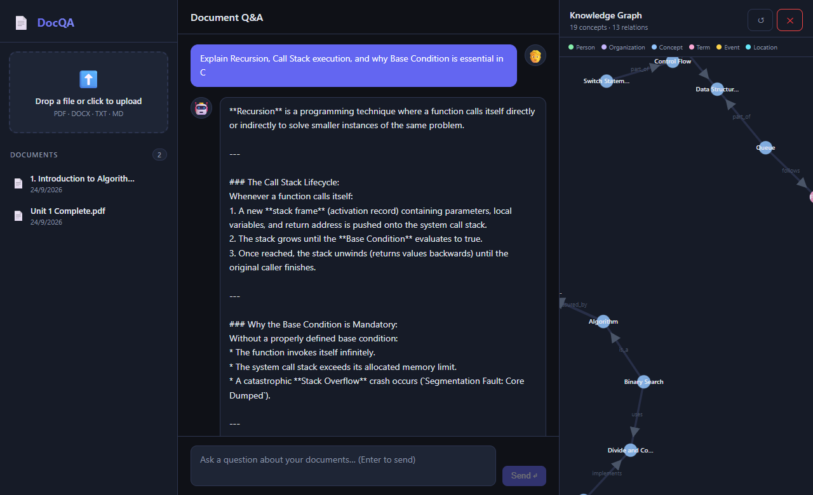
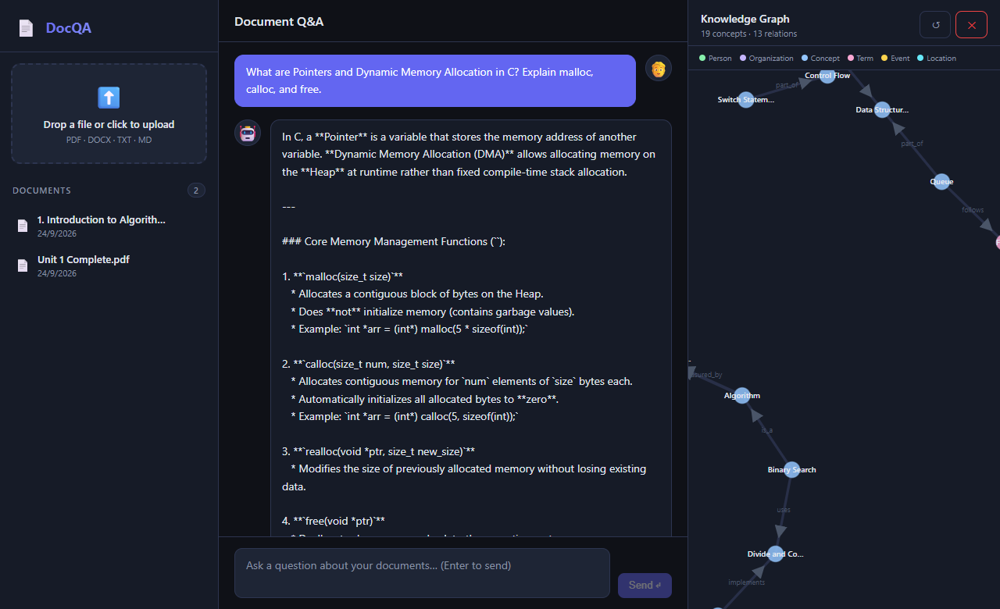

# DocQA Model Outputs & Question-Answer Gallery

This gallery showcases example query outputs generated by **DocQA** across the indexed university course documents (*"Introduction to Algorithm"* and *"Unit 1 Complete (Data Structures & C)"*).

---

## 📸 Stitched Panoramic View (Complete Q&A)

### 1. Switch Statement & Control Flow in C (Continuous Stitched View)
*Stitched vertically across the conversation scrollview from continuous UI captures:*

  

---

## 🖼️ Query Showcase Gallery

| # | Question & Topic | Preview |
|:---:|:---|:---|
| **01** | **Switch Statement Overview** *Control flow, syntax, cases, break, and practical menu example in C* | [01_switch_statement_output.png](01_switch_statement_output.png) |
| **02** | **Binary Search Algorithm** *Prerequisites, pointer logic, C implementation, and $O(\log n)$ analysis* | [02_binary_search_algorithm.png](02_binary_search_algorithm.png) |
| **03** | **Time Complexity & Big O Notation** *Asymptotic upper bounds, complexity rankings ($O(1)$ to $O(2^n)$), and calculation rules* | [03_time_complexity_big_o.png](03_time_complexity_big_o.png) |
| **04** | **Linear vs. Non-Linear Data Structures** *Comparative parameters: arrangement, traversal levels, memory layout, and tradeoffs* | [04_linear_vs_nonlinear_ds.png](04_linear_vs_nonlinear_ds.png) |
| **05** | **Recursion & Base Condition** *Call stack mechanics, stack overflow prevention, and factorial execution in C* | [05_recursion_and_base_condition.png](05_recursion_and_base_condition.png) |
| **06** | **Pointers & Dynamic Memory Allocation** *Heap vs Stack memory, `malloc`, `calloc`, `realloc`, `free`, and avoiding memory leaks* | [06_pointers_and_dynamic_memory.png](06_pointers_and_dynamic_memory.png) |
| **07** | **Merge Sort (Divide and Conquer)** *Divide, Conquer, and Combine stages with $\Theta(n \log n)$ recurrence relation proof* | [07_merge_sort_divide_conquer.png](07_merge_sort_divide_conquer.png) |
| **08** | **Stack Data Structure & LIFO** *Push, Pop, Peek, $O(1)$ operations, and balanced parentheses syntax checking* | [08_stack_data_structure_lifo.png](08_stack_data_structure_lifo.png) |
| **09** | **Circular Queue & Modulo Indexing** *FIFO mechanics, solving false overflow in linear queues, and circular pointers* | [09_queue_and_circular_queue.png](09_queue_and_circular_queue.png) |
| **10** | **If-Else Ladder vs. Switch Case** *Jump table compilation efficiency vs sequential branch evaluation* | [10_if_else_vs_switch_case.png](10_if_else_vs_switch_case.png) |
| **11** | **Algorithm Characteristics** *Donald Knuth's 5 criteria: Input, Output, Definiteness, Finiteness, Effectiveness* | [11_algorithm_properties.png](11_algorithm_properties.png) |
| **12** | **Graph Traversal: BFS vs. DFS** *Queue vs Stack exploration, shortest unweighted paths, and real-world use cases* | [12_graph_traversal_bfs_vs_dfs.png](12_graph_traversal_bfs_vs_dfs.png) |

---

### Sample Previews

#### Binary Search Algorithm ($O(\log n)$)

#### Time Complexity & Big O Notation

#### Recursion & Call Stack Execution

#### Dynamic Memory Allocation (`malloc`, `calloc`, `free`)

